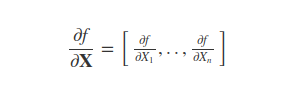

# Extending the Comparison of Classification Models for Rare Civil War Onsets

In similar fashion as [Muchlinski et al., 2016](http://davidsiroky.faculty.asu.edu/predictcivilwar.pdf), this blog aims to add discussion and facilitate usage and awareness of the insofar discarded predictive statistical methods in political science, to aid in accurately predicting significant events such as civil wars. Comparisons are made via Roc-Auc Curves to compare the performance of K-Nearest Neighbors, Support Vector Machines, Random Forests, Boosted Decision Trees, and Neural Networks. Particular attention is afforded to the performance of this methods when coupled with, but also without feature selection methods. The three feature selection methods of no feature selection, offline selection with Chi and Anova, and online selection with Recursive Feature Elimination are applied, in order to best illustrate which models can, and which cannot leverage the data to feature select by themselves. Lastly, certain models provide the benefit of human interpretability in how they obtain their predictions, such as the Random Forest and the Boosted Decision Tree. These are illustrated and contrasted to the uninterpretable models.

Note that all code is contained [here](https://github.com/epfl-ada/ada-2020-project-milestone-p3-p3_klr)

## Pre-Processing
A first, often underestimated procedure in data related tasks pertains to the cleanliness of the data. Indeed, the vast array of the data presented is often daunting, and tackling this variety is oftentimes problematic. In the case of this blog, we will be using a variety of modelling techniques, which while some of them are invariant towards data scaling, others are not. Such an example is support vector machines, which is due in summary to the fact that this method constructs a classifier based on distance between points, called support vectors. If these are of different scale, then different dimensions are able to disproportionately influence the delimitation of the hyperplanes, for more information read [here](https://www.csie.ntu.edu.tw/~cjlin/papers/guide/guide.pdf). Their utilization therefore can pose problems to newcomers who forget easy but significant steps. Having exemplified the necessity of incorporating data pre-processing in combination with statistical models, here we present a first method which the python library `scikit-learn` provides, allowing to devise full-fledged modelling pipelines, to never run into such issues again! 

Note that for ease of translatability of code presented in this blog, the offerings of `scikit-learn` will be extensively displayed, but will also be combined with external libraries such as `keras`, `tensorflow` which are two popular libraries allowing for GPU allocation of neural networks, and `imbalanced-learn` which serves as a `scikit-learn` wrapper providing additional options to tackle imbalanced datasets. 

### Devising a Pipeline 
Having shown the necessity of a multi-step process in data application tasks, the facilitation of the `scikit-learn` module `pipeline` allows for a stored function, in which the different steps of the user-desired process from start to finish may be stored. Both its `make_pipeline` and `Pipeline` allow for simple inclusion of a multi-step processus, with the main difference of the former and latter being that the former does not allow for internal naming of the steps, where it instead automatically includes names the steps by their lowercase of their types, as shown in the [documentation](https://scikit-learn.org/stable/modules/generated/sklearn.pipeline.make_pipeline.html#sklearn.pipeline.make_pipeline). This is illustrated in the following example, where we create a pipeline including standard-scaling, the practice of centering the data around 0 with a standard deviation of 1, and a `scikit-learn` standard Support Vector Machine for Classification.

```python
# Import the two methods, as well as the standard scaling and SVM
from sklearn.pipeline import Pipeline, make_pipeline
from sklearn.preprocessing import StandardScaler
from sklearn.svm import SVC

# Define our two steps and pass them into the pipeline
my_svm = SVC(random_state = 0) # note the use of a random_state for scientific reproducibility!
my_std = StandardScaler()

named_pipe = Pipeline([('fancy_preprocessing_name',my_std), ('fancy_classifier_name',my_svm)])
auto_named_pipe =  make_pipeline(my_std, my_svm)
```

These pipelines are extremely convenient, as now the methods `predict` and `fit` when used on the pipelines (pipe for short) are able to run a series of steps, reducing cumbersome or repetitive code. Note a practical advantage of the `Pipeline` method which allows for user-named steps, is that when modifying steps inside the pipeline, this user-defined name can provide code clarity in contrast to the automatic named steps with `make_pipeline`. Building on the previous example, the modification of the kernel of the SVM would be done as following for both pipelines:

```python
named_pipe['fancy_classifier_name'].set_params(random_state=5)
auto_named_pipe['svc'].set_params(random_state=5)
```

While this is all fine and dandy. Is this really worth the hassle? A key addition that these pipelines provide, is their easy coupling with K-fold Cross Validation. Indeed, if CV is to be carried out in the most rigorous fashion, the testing set of each fold should in fact be completely set aside, and remain untouched. Pipelines allow for this very addition, as unlike individual steps which must be separately trained and evaluated before moving to the next step, `scikit-learn` pipelines allow for the training and testing of multiple steps separately. As such, a loss in rigor which remains widespread is eliminated, justifying the spread of this message! While it would be facetious to state that in such a simple pipeline the loss of generality of the model would be large, in a more complex pipeline such as the ones devised in this notebook, this draws its usefulness. 

### Feature selection
So far, we have discussed the necessity of including pre-processing methods to tackle scale-variance which may affect models. A secondary obstacle which pre-processing techniques can help tackle, relates to feature selection. Simply put, feature selection aims at the inclusion or exclusion of the features themselves. Why would this even be desirable? Is more data not better in general? Despite intuition perhaps leaning towards the perception that an increase of data is always a benefit towards statistical learning methods, as they in layman terms, have more to learn from, this is not as straightforward to claim. In fact, the exclusion of features may offer a wide array which interest data analysis, including an increase in model training speed, a reduction in model complexity in favor of generalization towards out-of-sample data, or even easy interpretability. Further, whilst certain models are themselves able to pseudo feature select via their innate architectures, others are not, and as such are harmed by noisy data which at these models' detriment harms their predictive ability. Precisely, this concept is what we will illustrate on a series of chosen models. 

Okay, so enough about their benefits. How do we actually select these features to include or exclude? Surely this is not an arbitrary choice! Truth be told, too many approaches exist towards this to all feature inside this blog. Therefore, we select an online and offline feature selection method which we depict below, the first denoting the online interaction with the model in selecting the features, while the second denotes independent feature-selection without any model interplay. This, in combination with the more illustrious do-no-feature-selection approach, should serve to paint a picture of their contrasting effects and interplay with statistical models.


### Recursive Feature Elimination
Owing to the recursion mentioned in its name, recursive feature elimination (RFE) operates via an iterative backwards-selection approach towards determining best features. This iterative process, is however not pairable with any method, as some estimate of predictor ranking is expected. Nonetheless, non-trivial extensions do exist towards some models, as evidenced [here](https://bmcbioinformatics.biomedcentral.com/articles/10.1186/s12859-018-2451-4), though standard `scikit-learn` does not provide for them, as it does not allow RFE for models which do not return coefficients (object attribute `.coef_`). In a nutshell, RFE utilizes a given algorithm to rank features by their importance (which can differ in interpretation from model to model) contribution, before discarding those least important, and recommencing this iterative process. Interestingly, despite RFE requiring a model in order to run its iterative online determination of the best parameters, the model need not necessarily be the one next used in the pipeline. Yes, this means that if a certain model, say Random Forest best determines the important features of a dataset, this can serve to pre-process data for example for a Support Vector Machine. 

The following code block illustrates the easy incorporation of RFE that `scikit-learn` allows for into a Pipeline, for both a cross-validated RFE which works similarly, and standalone RFE. 

```python
# import RFE and classifier
from sklearn.feature_selection import RFE, RFECV # both have similar usage, only the first is shown
from sklearn.ensemble import RandomForestClassifier
from sklearn.pipeline import Pipeline
from sklearn.preprocessing import StandardScaler
from sklearn.svm import SVC

my_svm = SVC(random_state = 0)
my_std = StandardScaler()

# define balanced random forest paired with RFE
rand_forest = RandomForestClassifier(random_state = 0)
rfe = RFE(rand_forest) 

# include in Support Vector Machine Pipeline
pipe_svm = Pipeline([('std', my_std),('rfe', rfe),('clf', my_svm)])
```

### Chi & ANOVA

The Chi-square test is intended to test how likely it is that an observed distribution is due to chance. It measures how well the observed distribution of data fits with the distribution that is expected if the variables are independent.

A Chi-square test is designed to analyze categorical data and will not work with parametric or continuous data. For example, taking into the consideration that the exam period is approaching, the professors may want to test whether attending class influences how students perform during the session, using grades (from 0-100) as data would not be appropriate for a Chi-square test. However, arranging students into the categories "Pass" and "Fail" will work.

Univariate feature selection works by selecting the best features based on univariate statistical tests and can be used as a preprocessing step in [scikit-learn](https://scikit-learn.org/stable/modules/feature_selection.html#univariate-feature-selection). As a rule of thumb, we have decided that dropping 66% of the features would be a good threshold. 

```python
chi =  SelectPercentile(chi2, percentile=30)
```

However, we have seen that chi tests only work for categorigal features so we need a method to specify which columns are to be used with xhi squared in the feature extraction step. Fortunetely, this can be wasily achieved using The ColumnTransformer from scikit-learn.
> Applies transformers to columns of an array or pandas DataFrame.

> This estimator allows different columns or column subsets of the input to be transformed separately and the features generated by each transformer will be concatenated to form a single feature space. This is useful for heterogeneous or columnar data, to combine several feature extraction mechanisms or transformations into a single transformer. 

Let's separate the categorical features from the numerical ones:

```python
def categorical_filter(df, low_exclusive = 2, high_inclusive = 15):
    """function returns features (col_names) that have unique values
    less than or equal to n_categories

    """
    list_of_features = []
    for i in df.columns:
        k = sorted(df[i].unique())
        if k[0] < 0 or all(isinstance(x, np.int64) for x in k) == False:
            continue

        if low_exclusive == high_inclusive:
            if df[i].nunique() <= low_exclusive :
                list_of_features.append(i)
        else:
            if high_inclusive >= df[i].nunique() > low_exclusive :
                list_of_features.append(i)
    return list_of_features


def get_col_indexes(df, cols):
    return [df.columns.get_loc(c) for c in cols if c in df]
    
# big number, but there are no numerical fatures with this range
cat = categorical_filter(X, 1, 15) 
num = X.columns.difference(cat)

num_str = num.copy()
cat_Str = cat.copy()

cat = get_col_indexes(X, cat)
num = get_col_indexes(X, num)

fe = ColumnTransformer(
    transformers=[
        ('num', ano, [*range(len(num))]),
        ('cat', chi, [*range(len(num) + 1, len(num) + len(cat))])
        ]
   )
```

We have taken everything into consideration, right? Well, the execution failed because it had encountered negative values in the categorical variables class so the chi test failed. How can that be? We checked that the lowest value should be greater than 0. The reason is introduced by the standard scaler so we need to exclude the categorical data from this step.

```python
ct = make_column_transformer((StandardScaler(), num), remainder='passthrough')
```

The passthrough parameter means that the columns which where not specified in the num list are ignored and added to the standardized dataframe afterwards resulting in a different order than the initial order. For this reason in the column transformer we have created the ranges instead of just passing the list of indexes that we already have.

For numerical features we use Analysis of variance (ANOVA). It is a parametric statistical hypothesis test for determining whether the means from two or more samples of data come from the same distribution or not.

 SelectKBest is similar to SelectPercentile, but you do not specify the percentage of features to be kept, but instead the number. We used the same percentage as before to determine the number of features that should be kept.
 
 ```python
 ano = SelectKBest(f_classif, k=22)
 ```
 
In the end, the neural network did not fit perfectly in each of our pipeline. In both online and offline feature extraction the number of features is reduced before the training takes place, but the neural network needed to know the size of the input layer. Because of this, a partial pipeline needed to be run to calculate the size needed before creating the model.

```python
X_tr = ct.fit_transform(X)
X_tr = fe.fit_transform(X_tr, y)

NN = NeuralNetwork(build_fn=make_model, nr_features=X_tr.shape[-1], verbose=0, **params_nn)
NN._estimator_type = "classifier"
``` 

## Grid Search
Moving onwards, before speaking about model-specifics and their own intricacies, particular emphasis is afforded to clarifying an approach towards deriving for each different one, their best performing parameters (according to some metric which also needs to be chosen depending on a user-defined objective!). Indeed, hyperparameter optimization remains a complex and deep research field, though an often reoccurring suggestion remains to couple Cross-Validation with a search across all combinations of parameters, called Grid Search. Then, the highest scoring parameters are determined best for the particular mode. As combinations between parameters increase exponentially as separate values are added to the grid, computational limits must be considered too, with some models already incurring an expensive cost for even single executions! While this is not the case due to the simplicity of the models used in this notebook, and a nifty parallelization of grid search which `scikit-learn` allows for which is exemplified below, an alternative is random search. Random search does precisely what its name suggests, it randomly decides upon a subset of combinations to trial, which has been shown increased efficiency on a variety of learning algorithms and data sets [here](https://jmlr.csail.mit.edu/papers/volume13/bergstra12a/bergstra12a.pdf). Random search is also easily incorporable via this method, by simply passing two dictionaries of parameter grids into the `GridSearchCV` function as a list, i.e. `[grid_1, grid_2]` and proved particularly helpful in the case of support vector machines with polynomial kernels, to not compute uninfluential degree combinations for kernels which were non-polynomial. 

Here we illustrate the coupling of a `scikit-learn` and a pipeline. 

```python
from sklearn.model_selection import GridSearchCV
from sklearn.pipeline import Pipeline
from sklearn.ensemble import AdaBoostClassifier
from sklearn.tree import DecisionTreeClassifier
from sklearn.preprocessing import StandardScaler

n_jobs = 6 # number of parallel processes to use!

# folds and scoring desired to compare parameters
k_folds = 5
scoring = 'f1'

# define parameter grid
trees = [50,100,150]
learning_rates = [0.1,0.5,1]
max_depth = [7,8,9]

# note the naming convention, clf__ to attribute parameters to the clf__ named pipeline step
param_grid = {'clf__n_estimators' : trees,
              'clf__learning_rate' :  learning_rates,
              'clf__base_estimator__max_depth' : max_depth}

# create pipeline upon which search should occur
my_bdt = AdaBoostClassifier(base_estimator = DecisionTreeClassifier(), random_state=0)
my_std = StandardScaler()

pipe = Pipeline([('std',my_std), ('clf',my_bdt)])

grid_search = GridSearchCV(pipe, param_grid, cv=k_folds, scoring=scoring, verbose=1, n_jobs=n_jobs)
```
Then utilizing data, this grid_search can be fit utilizing its `fit` method, and then the best parameters can be ranked and retrieved according to associated scores! Full-fledged integration of Cross validation steps and grid search as such is extremely easy in `scikit-learn`, allowing for even simple incorporation of even non `scikit-learn` algorithms such as `keras` neural networks also evidenced in this notebook. 

A last important consideration when it comes to Grid Search, is that if the resulting best-found parameters are at the edge of the proposed grid, how can one be confident that this is in fact the best parameter? As such, the inclusion of additional values would be necessary in order to find a best-performing parameter and eliminate the mystery of whether the next step in that grid direction would further improve the model!

## Understanding the inner-workings of Classification Methods 
As data varies widely in its shape and form, a first crucial step when employing statistical models, is understanding, in depth, how they are constructed and are able to use data to *learn*. Here we clarify how the five models we compare function in order to better understand their strengths, but also weaknesses!

### K-Nearest Neighbors
K-Nearest Neighbors (abbreviated KNN) is a supervised machine learning technique which, as its name suggests, uses closeby neighbors to classify observations. As such, the data itself serves in essence as the model, with few parameters available for tuning, which can both be a boon or bane. Evaluating proximity is one of the first available parameters, and allowing for a variety of metrics to evaluate the distance between observations, including Manhattan Distance, Euclidean Distance, Chebychev Distance, Hamming Distance, Cosine Similarity (utilizing Cosine distance), and more. Each of these presents both advantages and disadvantages in their use, with some more or less sensitive to outliers, while others are orientation rather than magnitude based such as Cosine Distance which is preferred in settings where direction is more influential than magnitude. 


<figure align="center">
  
  <figcaption align="center">KNN Illustration | Source: "https://www.datacamp.com/community/tutorials/k-nearest-neighbor-classification-scikit-learn"
  </figcaption>
</figure>


The above figure illustrates how this algorithm allows for inference, with a k value equal to 1. This parameter being a principal hyperparameter available for tuning, and determinable via aid of grid search. The following illustrates the quick adoption of this algorithm which `scikit-learn` provides. 

```python
# import classifier
from sklearn.neighbors import KNeighborsClassifier

# initialise it
nearest_neighbors = KNeighborsClassifier()
```

### Support Vector Machines
Support Vector Machines were included in this blog for the very reason that they are conceptually often misunderstood with overfrequent confusion as to their difference with Logistic Regressions which in essence originate from the idea proposed by linear regressions. On the other hand, Support Vector Machines are much more geometrically motivated as explained [here](https://stats.stackexchange.com/questions/95340/comparing-svm-and-logistic-regression) and [here](https://www.robots.ox.ac.uk/~cvrg/bennett00duality.pdf). 


<figure align="center">
  
  <figcaption align="center">KNN Illustration | Source: https://towardsdatascience.com/support-vector-machine-simply-explained-fee28eba5496</figcaption>
</figure>

Above is illustrated the general concept surrounding Support Vector Machines. This algorithm constructs support vectors (hence the name), which each aim to support the widest margin possible between classes in a resulting hyperplane. This maximisation of the margin is not motivated in the same way in contrast with the logistic regression although a separating line does conceedingly allow for the aforementioned confusion.

```python
# Import support vector machine classifier 
from sklearn.svm import SVC

# Define our two steps and pass them into the pipeline
my_svm = SVC() 
```

### Random Forests
Random Forest, is an ensemble learning method, building upon the individual concept of decision trees, and utilizing averaging across an often large number of decision trees in order to provide increasing model predictive power. This is rather intuitive, as the forming of an ensemble to make decisions enables a decrease in bias of individual constituents, as each tree's decision is no longer final, and its individual errors may be compensated for by the group! Coupling this with a different set of features for constituent trees to train upon, as well as sampling observations randomly via bootstrapping, provides for increased robustness and invariance of the model, in favor of generalization towards out-of-sample data. Therefore, by construction, the model trains itself to be robust. 
Increased robustness may nonetheless be afforded to the training of the model, particularly in how each tree samples across the classes it should predict. Downsampling, in order to force the tree to attribute importance to both the minority and majority class is illustrated in the following code block, and the `imbalanced-learn` python library is particularly helpful in allowing for an integration of this downsampling into the `scikit-learn` Random Forest Classifier.

```python
# import both random forest classifiers
from imblearn.ensemble import BalancedRandomForestClassifier
from sklearn.ensemble import RandomForestClassifier

# initialise classifiers ready to be incorporated in pipelines 
balanced_random_forest = BalancedRandomForestClassifier(sampling_strategy = 1/2) # note the ability for integrated downsampling!
random_forest = RandomForestClassifier()
```

### Boosted Decision Trees

In contrast with Random Forests previously described, Boosted Decision uses Boosting as it relies on training weak learners sequentially instead of in parallel while applying weights to samples to give more importance to previously misclassified ones (AdaBoostClassifier). This is particularly interesting in the case of imbalanced dataset, as events/samples that are hard to predict (here: war onsets) will have their weights increased so that subsequent learners are forced to concentrate their effort on classifying them well. 

What does it mean? In a nutshell, one can image a bunch a manual workers building an item (such as a table for instance) in series, and each subsequent worker in this work chain will focus on building the item from scratch but focusing on what the previous workers did wrong. "Oh, I need be careful not to forget the 4th table leg like the last worker and to not leave a hole in the table's center like the worker before him".

Our hope is that such a method would be more suited to imbalanced data than Random Forests as it indirectly makes it more balanced by applying these weights. 

```python
# import decision tree classifier and booster classifier
from sklearn.ensemble import AdaBoostClassifier
from sklearn.tree import DecisionTreeClassifier

# initialise boosted decision tree
boosted_decision_tree = AdaBoostClassifier(base_estimator = DecisionTreeClassifier())
```

### Neural Networks

Deep learning has seen a huge boost in popularity in the recent years not only in the scientific community, but in the mainstream as well. The main applications that contributed to its success are computer vision, where self-driving cars have seen a huge media attention and natural language processing(NLP) that reached the audience in terms of voice assistants. The building block that stays at the foundation of this domain is the neural network, but what exactly are these?

Artificial Neural Networks(abbreviated ANN) or usually simply Neural Networks(NN) is another machine learning technique that can be trained in supervised or unsupervised manner and as the name suggests was inspired by the network of neurons from mammal's brain, more specifically, the human brain. The terms is not new, dating back to 1940s, but the advancement in GPU provided reasearchers with the ability to train more complex models.

Let's dive deeper into the subject. Neural networks are multi-layer networks of neurons. Bellow we can see a network used for classification.

<figure align="center">
  
  <figcaption align="center">A single-layer fully-connected neural network used for classification| Source: https://towardsdatascience.com/coding-up-a-neural-network-classifier-from-scratch-977d235d8a24</figcaption>
</figure>


Let's analyse its structure, from left to right:

1. The first layer is called **input layer**
2. First *hidden layer*
3. Second *hidden layer*
4. The last layer that produce the prediction is called **output** layer

The connection between neurons is represented by arrows and indicates the normal flow, during prediction, of the data through the network, from the input layer through the output layer. During the training process there is one step called backpropagation when the flow is reversed and the weights associated to each arrow is updated and the actual learning takes place.

Our model has 2 inputs and a two neurons hidden layer. As such, connecting Input Layer to Hidden Layer 1 requires 4 connections. The mathematical expression of first neuron in the first layer is the following:

<div style="text-align:center "></div>

We can use the matrix notation for the Hidden Layer 1:

<div style="text-align:center"></div>

To generalize, any layer in the network can be described by:
 
<div style="text-align:center"></div>

### Learning process

The learning process for neural networks is very similar to many other models from the data science world - we define a **cost function** and use *gradient descent* optimization to minimize the loss(cost function value). However, the process is more complicated than let's say, linear regression, where the coefficients are toggled in isolation because changing one weight/bias will influence the following layers.

### Gradient descent
Gradient descent is a iterative algorithm used to find the optimal values for its parameters. It starts from an initial set of values and updates them according to the loss and the user-defined learning rate.

* Start from initial values

* Calculate cost and gradient

* Update each parameter in the opposite direction of its gradient proportional to its value

* Recompute the cost and gradient until the minimum is reached or the loss is considered small enough

In mathematical notation:

<div style="text-align:center"></div>

The gradient of a function is calculated by:

<div style="text-align:center"></div>

### Backpropagation

The derivative in a neural network is not always so easy at first glance to optimize as it would imply lots of recomputations. Backpropagation solves the problem by applying the chain rule when it calculates the gradient of the loss function. It iterates backwards, from the last layer, one layer at a time avoiding redundant calculations.

 As an example let's consider a perceptron(no hidden layer) with MSE as the cost function. Then using the chain rule:

<div style="text-align:center"></div>

<div style="text-align:center"></div>

<div style="text-align:center"></div>

<div style="text-align:center"></div>

### Implementation

Scikit learn provides support for Neural Networks via the  [MLPRegressor](https://scikit-learn.org/stable/modules/neural_networks_supervised.html#regression) and [MLPClassifier](https://scikit-learn.org/stable/modules/neural_networks_supervised.html#classification) classes. The following is an example that depicts how to train the model and predict on a small dataset.

```python
from sklearn.neural_network import MLPClassifier
X = [[0., 0.], [1., 1.]]
y = [0, 1]
clf = MLPClassifier(solver='lbfgs', alpha=1e-5,
	                    hidden_layer_sizes=(5, 2), random_state=1)
clf.fit(X, y)
clf.predict([[2., 2.], [-1., -2.]])
```
> array([1, 0])

Unfortunately, MLPClassifier was not fit for our use case because at this moment it only supports Cross-Entropy loss function and cannot be changed by a custom loss function and unlike other models implemented in the library, it does not support class weights. This is unfortunate because our dataset is heavily unbalanced hence the model overfitted after very few iterations returning 0 every time since it was a solution that provided great accuracy fast.

We had to choose another deep learning library that would be compatible with our pipeline. Keras is a library that focused on creating a simple API for creating deep learning models. In the past it needed to run on top of a backend framework, nowadays is it integrated in Google's TensorFlow. We chose Keras because it offers a wrapper for scikit_learn.

The Keras wrapper takes as argument a function that returns the model that needs to be wrapped and a variable sized list of arguments that can be applied either for the build function or the wrapper class. Creating a densely connected model in Keras is very easy, via the Sequential class that accepts a list of layers, or like in the alternative function each layer can be added at any point in time in a sequential manner before the compile method is called. The model can then be configured, selecting the loss function, optimization algorithm or even metrics.

```python
def make_model(nr_features, dropout1, dropout2, optimizer, output_bias=None):
    if output_bias is not None:
        output_bias = tf.keras.initializers.Constant(output_bias)

    model = keras.Sequential([
        keras.layers.Dense(16, activation='relu', input_shape=(nr_features,)),
        keras.layers.Dropout(dropout1),
        keras.layers.Dense(16, activation='relu'),
        keras.layers.Dropout(dropout2),
        keras.layers.Dense(1, activation='sigmoid', bias_initializer=output_bias)
    ])

    model.compile(
        optimizer=optimizer,
        loss=keras.losses.BinaryCrossentropy())

    return model


def NeuralNetwork(build_fn, **kwargs):
    return keras.wrappers.scikit_learn.KerasClassifier(build_fn=build_fn, **kwargs)
    
def make_model_alternate(nr_features, dropout1, dropout2, optimizer, output_bias=None):
    if output_bias is not None:
        output_bias = tf.keras.initializers.Constant(output_bias)

    model = keras.Sequential()
    model.add(keras.layers.Dense(16, activation='relu', input_shape=(nr_features,)))
    model.add(keras.layers.Dropout(dropout1))
    model.add(keras.layers.Dense(16, activation='relu'))
    model.add(keras.layers.Dropout(dropout2))
    model.add(keras.layers.Dense(1, activation='sigmoid', bias_initializer=output_bias))

    model.compile(
        optimizer=optimizer,
        loss=keras.losses.BinaryCrossentropy())

    return model
    
```

Dropout is a regularization method used for neural networks tha probabilistically drops out nodes in the networks during training. We have selected the best dropout values and also the best optimization algorithm using grid search.

The wrapper provides the model with the same API, or at very least a compatible API therefore we can easily use it in our Pipelines and Grid search that were discussed earlier.

## Comparing Model Performance with Roc-Auc Curves
In this section, we present our methodology, having introduced the workings of the multiplicity of the methods employed, to compare each of our methods predictive ability when faced with imbalanced data. For each of these models, we perform a grid search on a subset of their parameters to allow them to best perform. For K-Nearest Neighbors this includes a variety of kernels, degrees in the case of the polynomial one, and distances provided by `scikit-learn`'s classifier. Meanwhile, for Random Forests, these are an entirely new set of parameters to search upon, namely the maximal depth, the downsampling strategy, and the number of constituent trees. This approach was adopted towards all models in order to let them best perform in their comparisons, and this hyperparameter optimization remains a shortcoming of Muchlinski et. al which we proposed a solution for, with our above example of GridSearchCV usage.

In order to compare model performance, we employ Roc-Auc Curves, although judiciously rightfully, there exists a possible critique that an F1-score comparison would perhaps be more suited to this class imbalanced problem, we would like to build upon the cross-model performances of Muchlinski et. al, Figure 2. This Roc-Auc Curve concept is straightforward to understand however which provides benefits to compare across models, as one may conceptually perceive it as the predictive ability of a binary classification system when its prediction threshold is varied. Thus, it shows on the x-axis the False Positive Rate, and the y-axis the True Positive Rates, and the diagonal 45 degree line indicates the commonly called chance, as it represents if the model predicted purely by chance.

### No Feature Selection
In this part, we first establish a no-feature selection performance of the models in order to later be able to comment on their performance with the inclusion of both devised feature selection methods. Note that for this part, we determine the hyperparameters, and then set them to be the same for the later Roc-Auc curves which, while it remains a shortcoming in our approach towards showing these cross-model performances coupled with feature selection, was necessary due to computational limits. Results are shown below. 

<div>  </div>

In the above figure, a first observation we make is the wide variety of predictive range of our models. The very best performing models in our case are the Boosted Decision Tree and Random Forest, which present highly competitive result, and would require further metrics in order to solidify the justification as to why either should be preferred. On the other hand, we observe the seemingly shockingly low performance of KNNs. However, this performance is in fact not-so-shocking should we remember how this classifier is constructed, by using the d feature-determined dimensional space to determine neighbors. Intuitively, this spanned space only decreases the odds of proximate neighbors as the number of dimensions increasing, exemplifying the curse of dimensionality from which KNN greatly suffers—which perhaps feature selection may be able to tackle. Lastly, the Neural Network and the Support Vector Machine perform similarly, which is if anything impressive of the Support Vector Machine which is a simpler model to the Neural Network. If upon determination of further metrics no discrepancies leading to the preference of the Neural Network present themselves, the adoption of the Support Vector Machine over the Neural Network may be a good idea if following Occam's Razor.  

### Online Feature Selection (Recursive Feature Elimination)
<div>  </div>
Previously, we have seen the ROC-AUC without Feature Selection. How did Online Feature Selection influenced the methods' predictive power?

Let's look at the result, one method at a time and see what's going on here:

- K-Nearest Neighbors still has the same overall shape, but went from an AUC Score of 0.6629 to 0.6877. This change is significant, and also perfectly understandable. In fact, one of K-Nearest Neightbors greatest enemy is "the curse of dimensionality". Simply put, the more dimensions, the further away are samples from each other. By reducing the dimensionality and only keeping the relevant ones, two samples that are alike are closer together than without dimensionality reduction, thus improving the overall algorithm predictive power.

- Support Vector Machine has exactly the same overall shape (flat line around [0.3,0.5]) and thus suffered a bit in terms of AUC Score (went from 0.8297 to 0.8178). Why is that? It could be explained by the fact that Support Vector Machine revolves around finding a hyperplane to separate the data in two (0's on one side, 1's on the other side). Higher dimensions mean more degree of freedom to fit this hyperplane. However, one can note that the dimensionality reduction did not affect too much the AUC Score, meaning that the features selected do a good job in separating the two groups (reassuring us in the fact that the features from the online feature selection are not only useful on other methods such as Support Vector Machine, but also relevant in terms of "Variable Importance" analysis: see "The value of interpretable models" further down).

- Neural Network in the other hand benefited from the Online Feature Selection as its AUC Score went from 0.826 to 0.8366. This could be explained from the following rule of thumb: The more complex the model, the more it tends to overfit. Here, with N being the number of samples (fixed), the more features (D --> D' with D'>D ie: the more complex it is), the more prone the Neural Network is to overfit, thus affecting its predictive power on unseen data.

- Unlike previously where Boosted Decision Trees and Balanced Random Forest were almost alike (0.923 and 0.9284 in AUC Score), here Boosted Decision Trees took a toll and saw its AUC Score decrease to 0.8983. Why is that? This one is a bit harder to analyze. However, we can conclude something pretty interesting from this: as the Online Feature Selection was done using the Balanced Random Forest, the fact that Boosted Decision Trees performs significantly worse with these features indicate that both method do not use the same features in order to make the predictions (see "The value of interpretable models" where we compare the feature importance ranking of both method) and thus sheds light on the fact that Variable Importances deduced from models can differ heavily and thus any conclusion regarding the real relevance of a feature in Civil War Onset should be taken carefully.

- Balanced Random Forest saw almost no changes with Online Feature Selection (0.9284 to 0.9297, being an insignificant increase). This is expected, as Online Feature Selection is the method of recursively eliminating features without impacting the model performance. 

As a result, we see here that for really simple models (such as K-Nearest Neighbors) and really complex models (Neural Network), using Online Feature Selection helps as it fights against the curse of dimensionality (for KNN) and prevents overfitting (NN). For the other models, either it leaves them unchanged (like Balanced Random Forest), or decrease slightly their performance because they did not use the same variables as BRF to make their predictions (BDT) or work better in high dimensions (SVM).

### Offline Feature Selection (Anova & Chi)
<div>  </div>
razvan

## The value of interpretable models 

Sometimes, models are sought not only for their predictive power, but also for their interpretability. This is especially true in certain domains where a humanly understandable justification is required. Here, it is the case as the goal is to give tools to governors to prevent Civil War from happening. These tools should not only tell the politics if a Civil War is likely to happen (predictive power), but also on what to focus/act (interpretability).

Here, we will shed light on Balanced Random Forest and Boosted Decision Tree's interpretability by using a method to rank Variables Importances using a metric called Gini Importance, being the (normalized) total reduction of the criterion brought by that feature. In short, the more the feature separates well the data (most 0's on one side, most 1's on the other side), the higher the Gini importance. 

### Random Forest

<div>  </div>

Here, we plotted the Balanced Random Forest Feature Importances. On the y-axis are the features sorted by rank (at top being the most important features) and on the x-axis is their respective Mean Importance. Around each point, we plotted an error bar equal in length to two $\sigma$ with sigma being the standard deviation of the Gini Importance.

Here are the top 4 features:
- `sxpsq`: Primary commodity exports/GPD,squared, 
- `sxpnew`: Primary commodity exports/GPD, 
- `agexp`: Agricultural raw materials exports as percentage of merchandise exports; WDI, 
- `illiteracy`: % adult population illiterate; WDI

It is interesting to see that these top 4 features are well separated from others (errors bars are not superposing with the errors bars of the 5th and lower ranked features). Knowing that `sxpsq`and is only `sxpnew` squared, we have managed to shed light on the 3 main features that influence Civil War Onset by the largest amount... or did we?

Because these features are important in the Random Forest model to classify the samples doesn't necessarily mean that these features are important in real life in Civil War Onsets. For instance, really meaningful features explaining Civil War Onsets could be missing because not considered in the data (for instance because it has been overlooked) and as a result the models over-estimate the importance of the other features. Furthermore, this ranking might be heavily influenced by how the Random Forest is inherently built, which has nothing to do how real Civil War Onsets work.

It is also worth noting that the paper used a different metric to rank the Random Forest features and got a totally different ranking (our first features is their last!). 

This is why any conclusions regarding 'the most important features in Civil War Onsets' should be taken with a grain of salt. For now, the only thing we can assert is that for predicting Civil War Onsets using this BRF, these 3 features are the most useful, not more. Further investigations using experts are needed to expand this to the real world. 

### Boosted Decision Trees

We were genuinely impressed when we observed the following result for the Boosted Decision Trees:
<div>  </div>

Indeed, we were expecting similar results to Random Forest and also smaller error bars. But after thinking about it for a while, we understood that even though both methods use Decision Trees, the way they work is inherently different and therefore might not use the same features to classify the samples. This is also what the ROC curves indicated us after Online Feature Selection where `AdaBoostClassifier` performed worse with RF most important features. This would explain the ranking difference but how about these big error bars? Where does it come from? Our best guess is that `AdaBoostClassifier` doesn't give the same importance to features in all trees, as the following ones are built putting more emphasis on what the previous workers did wrong. 

If we consider again the previously introduced analogy with the workers building sequentially a table, the first worker will focus on the main features of the table and more or less manage to build it. The second worker however will focus more on what the previous one missed, changing the ranking of the "most important features to worry about" and so on. If we initialize differently the sequence (changing the first worker for instance), the ranking of the "most important features to worry about" for the next workers will change as well. In conclusion, the "most important features" in `AdaBoostClassifier` depends heavily on how it is built.

This is further evidence that whatever the ranking it should be further analyzed before drawing any conclusions as it is hard to quantify how much the model impact the ranking. A solution would be to find multiple type of models and build a ranking for each of them and compare them. If some features are in the top 4 in every single one of the models, it would mean that it is not here because of the model structure but because they have strong correlation with Civil War Onset. However, it is a hard task as most powerful models such as Neural Network do not have easy ways to come up with such rankings. Furthermore, it would not even give us the full story as correlation does not mean causation. In fact, the top 4 features in the model could be influenced by a non-studied variable that is the true cause of Civil War Onsets. In this case, taking political actions to act on the top 4 features of the models would not prevent Civil War Onsets, as the real culprit variable is still untouched.

## Wrapping Up

To sum up, predicting Civil War Onset is a tedious task, but the models implemented here give really encouraging results. Our Balanced Random Forest model outperformed the Random Forest of the original paper with an AUC score of 0.9284 compared to the previous best, 0.91, that we tried to beat in this project. 

The best two models in each try were represented by the Balanced Random Forest and Boosted Decision Trees. This suggests that tree structures work well with imbalanced datasets and can compensate for the bias.   

However, when sorting the variable by their importance in the decision process, we obtained a totally different ranking. This is an issue because it sheds light on how unreliable it is to use such metrics and incite us to be more careful before jumping to conclusions based on model interpretation. 

With this sad note, let's not forget that having different explanations for Civil War Onsets is not a bad thing, as it allows us to better grasp how complex and singular of an event it is and hope that future research can broaden our understanding of the domain.

Our proposal has not provided a definite solution to the problem, but we hope that it will inspire domain experts in their research. 

Thank you for reading our blog! 
